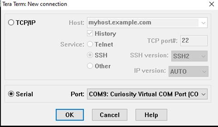

# Printing "Hello World" using UART for pic18f16q41
 In this application, "Hello World!" is printed to a terminal emulator using the UART peripheral. This application is the perfect fundamental starting point for getting your pic18f16q41 to complete various applications

## Related Documentation

* [PIC18F16Q41 Device Page](https://www.microchip.com/wwwproducts/en/PIC18F16Q41)

* [PIC18F16Q41 Users Guide](https://ww1.microchip.com/downloads/en/DeviceDoc/PIC18F16Q41-Curiosity-Nano-Hardware-User-Guide-DS50003048A.pdf)

* [PIC18F16Q41 Datasheet](https://ww1.microchip.com/downloads/en/DeviceDoc/PIC18F06-16Q41-DataSheet-40002214C.pdf)

## Software Used

* [MPLAB® IDE](https://www.microchip.com/en-us/development-tools-tools-and-software/mplab-x-ide)
* [MPLAB Code Configurator (MCC)](https://www.microchip.com/mplab/mplab-code-configurator)
* [MPLAB XC8 Compiler](https://www.microchip.com/en-us/development-tools-tools-and-software/mplab-xc-compilers)
*Tera Term

## Hardware Used

* [PIC18F16Q41 Product Information](https://www.microchip.com/wwwproducts/en/PIC18F16Q41)

## Setup

**Step #1: Creating the Project**
+ On the tool bar, click on New Project
+ Microchip Embedded; Standalone Project
+ Enter the Device
  + For this Project: PIC18F16Q41
+ Name the Project
  + Name: “PrintMessageUART”
  + **Note: The project name cannot have any empty spaces**

**Step #2: MPLAB Code Configurator(MCC)**

+	Modify the Clock Control
  +	Set “Clock Source” to High Frequency Internal Oscillator (HFINTOSC)
  + Set “HF Internal Clock” to 4_MHz
  + Set “Clock Divider” to 1

  

**Step #3: Adding UART Peripheral**

+ In Device Recourses:
  + Drivers &rarr; UART &rarr; UART2
+ Once the peripheral is added, modify the peripheral.
  +	Enable UART box should be checked
  + Enable transmit should be checked
  + Set the Baud Rate to 19200
  +	Redirect STDIO to UART should be checked since we are going to use a printf statement to send data to the UART peripheral
  + Everything else can be left as default settings

  

  **Step #4: Configure the Pins/Modify Pin Module**
  + There are two pins we need to configure, Transmitter(TX) and Receiver(RX)
    + TX is connected to pin RB7
    + RX is connected to pin RB5
    + Connect GPIO output to pin RC1 Output(Rename Pin Name to: LED0)
    +	Connect the pins turning those blue unlocked symbols into a green locked symbol.

      

      

  **Step #5: Generate the project**
  + Click the generate button in MCC to create appropriate header and source files for this configuration

  

  **Step #6: Modifying main.c**
  + Once the generation is complete, the new MCC Generated header and Source Files will now be present in the Project window, this will include the main.c source file. Click on the main.c file and you will see a while(1) loop where you can add your application code.
  + Select on the source files and open the “main.c” file
    +	As mentioned earlier we are going to put a printf and delay function in the while loop. This printf statement can have whatever you want to be printed.
      + LED0_Toggle();
      +	printf(“Hello World! \n\r”);
      + __delay_ms(500)

      

      + Make and Program the Device

  **Step #7: Terminal Emulator**

  + For this project, the terminal emulator program that is being used is TeraTerm
  + Open up a terminal emulator program on the host computer and select the COM port associated with the pic18f16q41

  

  + Recall in the UART2 peripheral we set the baud rate to 19200. Configure the terminal emulation program to communicate at the 19200 baud rate
    + Setup &rarr; Serial Port &rarr; Speed: 19200 &rarr; New Setting
      

  + Once the program is update with the new baud rate, the terminal window should appear and display the printf statement written in the while loop of the main.c

    

## Operation

This application displays a message on a terminal emulator

## Summary

This application shows how to set up the UART peripheral in order to display a message on a terminal emulator
