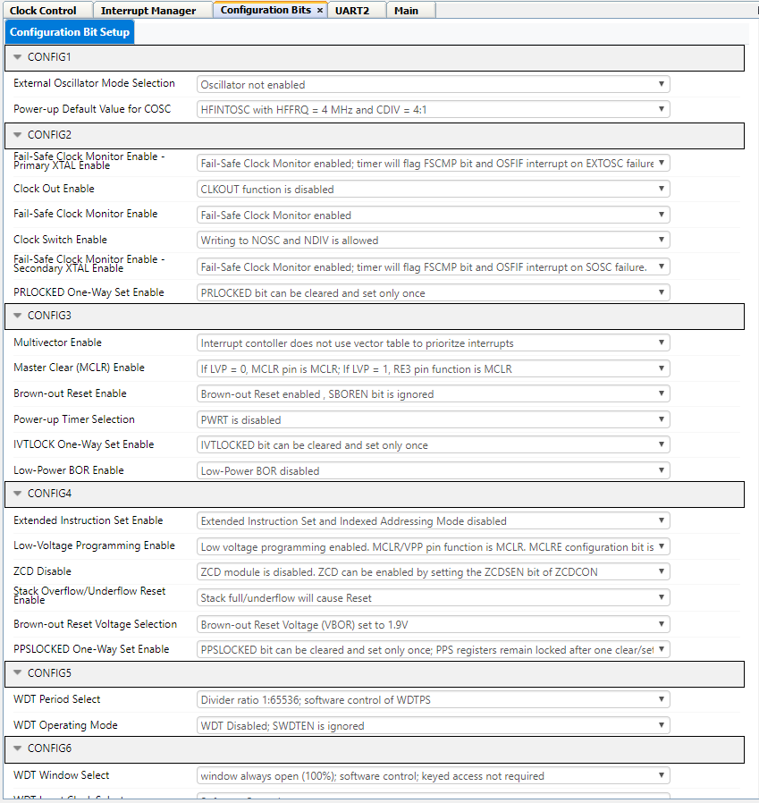
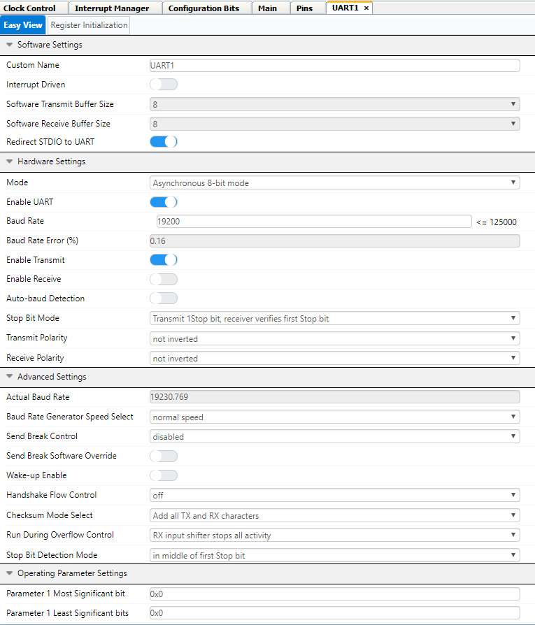
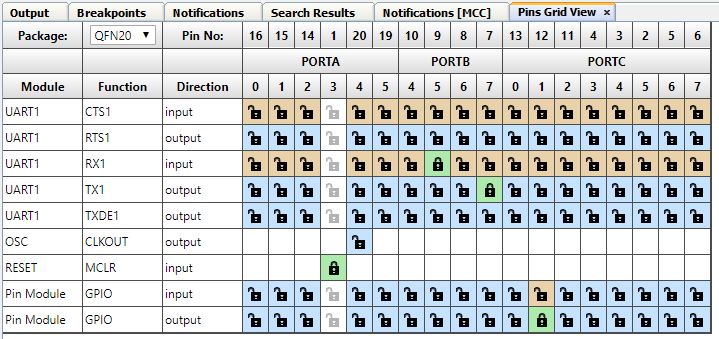

[](https://www.microchip.com)

# Printing "Hello World" using UART for PIC18F16Q41
  In this application, "Hello World!" is printed to a terminal emulator using the UART peripheral. This application is a good starting point for testing out the PIC18F16Q41.


## Related Documentation

* [PIC18F16Q41 Datasheet](https://ww1.microchip.com/downloads/en/DeviceDoc/PIC18F06-16Q41-DataSheet-40002214C.pdf)

* [PIC18F16Q41 Device Page](https://www.microchip.com/wwwproducts/en/PIC18F16Q41?utm_source=GitHub&utm_medium=TextLink&utm_campaign=MCU8_MMTCha_pic18q41&utm_content=pic18f16q41-uart-hello-world-mplab-mcc-github)

* [PIC18F16Q41 Curiosity Nano Users Guide](https://ww1.microchip.com/downloads/en/DeviceDoc/PIC18F16Q41-Curiosity-Nano-Hardware-User-Guide-DS50003048A.pdf)

## Software Used

* [MPLAB® X IDE v5.45](https://www.microchip.com/en-us/development-tools-tools-and-software/mplab-x-ide?utm_source=GitHub&utm_medium=TextLink&utm_campaign=MCU8_MMTCha_pic18q41&utm_content=pic18f16q41-uart-hello-world-mplab-mcc-github)
* [MPLAB Code Configurator (MCC) v4.1.0](https://www.microchip.com/mplab/mplab-code-configurator?utm_source=GitHub&utm_medium=TextLink&utm_campaign=MCU8_MMTCha_pic18q41&utm_content=pic18f16q41-uart-hello-world-mplab-mcc-github)
  * Melody Library v1.37.23 (or later)
* [MPLAB XC8 Compiler v2.31](https://www.microchip.com/en-us/development-tools-tools-and-software/mplab-xc-compilers?utm_source=GitHub&utm_medium=TextLink&utm_campaign=MCU8_MMTCha_pic18q41&utm_content=pic18f16q41-uart-hello-world-mplab-mcc-github)

* [PIC18F-Q_DFP v1.11.185](https://packs.download.microchip.com/)

* [MPLAB Data Visualizer Plugin](https://www.microchip.com/en-us/development-tools-tools-and-software/embedded-software-center/mplab-data-visualizer) or other serial terminal


## Hardware Used

* [PIC18F16Q41 Curiosity Nano (EV26Q64A)](https://www.microchip.com/DevelopmentTools/ProductDetails/PartNO/EV26Q64A?utm_source=GitHub&utm_medium=TextLink&utm_campaign=MCU8_MMTCha_pic18q41&utm_content=pic18f16q41-uart-hello-world-mplab-mcc-github)

## Setup

**Step #1: Creating the Project**
+ On the toolbar, click on New Project
+ Microchip Embedded; Standalone Project
+ Enter the Device
  + For this Project: PIC18F16Q41
+ Enter a name for this project, such as *PrintMessageUART*
  + Name: “PrintMessageUART”
  + **Note: The project name cannot have any empty spaces**


**Step #2: MPLAB Code Configurator (MCC)**

+ Set Configuration Bits
  + Disable "External Oscillator Mode Selection"
  + Set "Power-up Default Value for COSC" to "HFINTOSC with HFFRQ = 4MHz and CDIV = 4:1"
  + Ensure that "WDT Operating Mode" is set to "WDT Disabled; SWDTEN is ignored"

  

+	Modify the Clock Control
  +	Set “Clock Source” to High Frequency Internal Oscillator (HFINTOSC)
  + Set “HF Internal Clock” to 4_MHz
  + Set “Clock Divider” to 1

  


**Step #3: Adding UART Peripheral**

+ In Device Resources:
  + Drivers &rarr; UART &rarr; UART1
+ Once the peripheral is added, modify the peripheral.
  +	Enable UART box should be checked
  + Enable transmit should be checked
  + Set the Baud Rate to 19200
  +	Enable "Redirect STDIO to UART" in order to use the function (printf) for sending messages.
  + Everything else can be left as default settings




  **Step #4: Configure the Pins/Modify Pin Module**
  + There are two pins we need to configure, Transmit (TX) and Receive (RX).
    + TX is connected to pin RB7
    + RX is connected to pin RB5
    + Set GPIO output on pin RC1 (Rename pin to: LED0)
    +	Select the pins. When selected, the pins will change from a blue unlock into a green lock.




  **Step #5: Generate the project**
  + Click the generate button in MCC to create the appropriate header and source files for this configuration.


  **Step #6: Modifying main.c**
  + Once the generation is complete, the new MCC generated header and source files will be in the project window. Select the main.c file and you will see an empty while(1) loop where you can add your application code.
  + Select on the source files and open the “main.c” file
    +	As mentioned earlier we are going to put a printf and delay function in the while loop. This printf statement has what you want to be printed.

```         
    while(1)
    {
        LED0_Toggle();
        printf("Hello World!\n\r");
        __delay_ms(500);
    }
  ```

  + Make and Program the Device


  **Step #7: Terminal Emulator**

  + For this project, the terminal emulator program that is being used is TeraTerm.
  + Open up the serial terminal on the host computer and select the COM port associated with the Curiosity Nano. (COM port may vary)

 

  + Recall in the UART2 peripheral the **baud rate is set to 19200**. Configure the serial terminal to communicate at 19200 baud, no parity, and 1 stop bit.
    + Setup &rarr; Serial Port &rarr; Speed: 19200 &rarr; New Setting

      

  + If everything is setup correctly, then the serial terminal should start displaying the printf statement in the while loop.

    


## Summary

This application shows how to set up the UART peripheral and send a message to a serial terminal.
